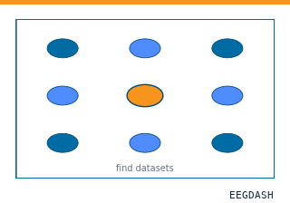
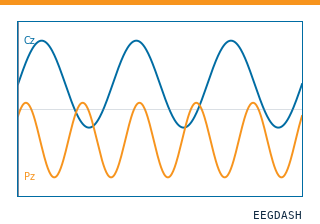
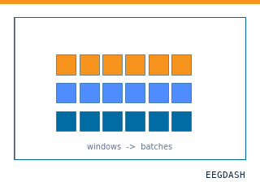
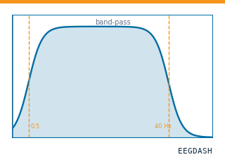
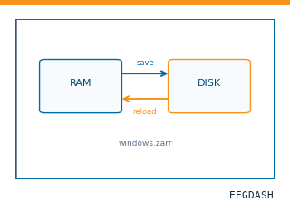
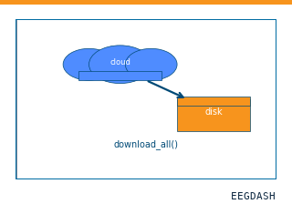

<!-- This documentation page is generated during the Sphinx build.
The underlying code is manually maintained and not autogenerated. --><div class="eegdash-ed-issue"><div class="crumb">EEGdash<span class="crumb-sep">›</span>OpenNeuro<span class="crumb-sep">›</span><b>DS006890</b></div><div>Iss. 6890 · 2 subjects · 870 recordings · CC0</div></div><div class="eegdash-ed-kicker">Dataset Brief · Longitudinal Multitask Wireless ECoG Data from Two Fully Impl…</div><aside class="eegdash-ed-rail"><h4>Field card</h4><dl><dt class="hdr">Identity</dt><dd class="hdrpad"></dd><dt>Dataset</dt><dd>DS006890</dd><dt>Version</dt><dd>v1.0.0</dd><dt>Source</dt><dd>OpenNeuro</dd><dt>License</dt><dd>CC0</dd><dt>Updated</dt><dd>2025-11-04</dd><dt>Contact</dt><dd>Huixiang Yang</dd><dt class="hdr">Signal</dt><dd class="hdrpad"></dd><dt>Subjects</dt><dd>2</dd><dt>Recordings</dt><dd>870</dd><dt>Modality</dt><dd>iEEG</dd><dt>Channels</dt><dd>50 (471), 66 (399)</dd><dt>Sample rate</dt><dd>1000 Hz</dd><dt>Duration</dt><dd>106 h</dd><dt>Size</dt><dd>41.2 GB</dd><dt>Tasks</dt><dd>5 tasks · <code>listening</code> · <code>pressing</code> · …</dd><dt>Sessions</dt><dd>251 · <code>day05</code> … <code>day99</code></dd><dt class="hdr">BIDS</dt><dd class="hdrpad"></dd><dt>BIDSVersion</dt><dd>1.9.0</dd><dt>Sidecars</dt><dd><span class='dim'>not yet probed</span></dd><dt>Events ann.</dt><dd>—</dd><dt>Metadata</dt><dd>100% · Complete</dd><dt>Storage</dt><dd><code>s3://openneuro.org/ds006890</code></dd><dt class="hdr">Tags</dt><dd class="hdrpad"></dd><dt>Pathology</dt><dd>['Healthy']</dd><dt>Paradigm</dt><dd>['Multisensory']</dd><dt>Type</dt><dd>['Motor']</dd><dt class="hdr">ML &amp; Reach</dt><dd class="hdrpad"></dd><dt>HF mirror</dt><dd><a href="https://huggingface.co/datasets/EEGDash/ds006890">EEGDash/ds006890</a></dd></dl><div class="doi"><span>Persistent identifier</span><a href="https://doi.org/10.18112/openneuro.ds006890.v1.0.0">10.18112/openneuro.ds006890.v1.0.0</a></div><div class="actions"><a href="https://openneuro.org/datasets/ds006890">OpenNeuro</a><a href="https://huggingface.co/datasets/EEGDash/ds006890">🤗 HF</a><a href="../../_static/dataset_generated/croissant/DS006890.croissant.json" download>Croissant</a></div></aside>

# DS006890: ieeg dataset, 2 subjects

<script type="application/ld+json">{"@context":"https://schema.org","@type":"Dataset","name":"Longitudinal Multitask Wireless ECoG Data from Two Fully Implanted Macaca fuscata","alternateName":"DS006890","description":"Longitudinal Multitask Wireless ECoG Data from Two Fully Implanted Macaca fuscata. ieeg dataset accessible via EEGDash as \`\`DS006890\`\` with standardized BIDS metadata.","url":"https://eegdash.org/api/dataset/eegdash.dataset.DS006890.html","keywords":["ieeg","BIDS","neuroscience","EEG","MEG"],"isAccessibleForFree":true,"includedInDataCatalog":{"@type":"DataCatalog","name":"EEG Dash","url":"https://eegdash.org/"},"identifier":"doi:10.18112/openneuro.ds006890.v1.0.0","sameAs":["https://doi.org/10.18112/openneuro.ds006890.v1.0.0","https://openneuro.org/datasets/ds006890","https://nemar.org/dataexplorer/detail?dataset_id=ds006890"],"creator":[{"@type":"Person","name":"Huixiang Yang"},{"@type":"Person","name":"Ryohei Fukuma"},{"@type":"Person","name":"Tomoyuki Namima"},{"@type":"Person","name":"Kotaro Okuda"},{"@type":"Person","name":"Asaya Nishi"},{"@type":"Person","name":"Takamitsu Iwata"},{"@type":"Person","name":"Abdi Reza"},{"@type":"Person","name":"Kota S Sasaki"},{"@type":"Person","name":"Taro Kaiju"},{"@type":"Person","name":"Gurlal Gill"},{"@type":"Person","name":"Haruhiko Kishima"},{"@type":"Person","name":"Shinji Nishimoto"},{"@type":"Person","name":"Takufumi Yanagisawa"}],"license":"https://creativecommons.org/publicdomain/zero/1.0/","datePublished":"2025-01-01"}</script>

*Longitudinal Multitask Wireless ECoG Data from Two Fully Implanted Macaca fuscata*

**Citation:** Huixiang Yang, Ryohei Fukuma, Tomoyuki Namima, Kotaro Okuda, Asaya Nishi, Takamitsu Iwata, Abdi Reza, Kota S Sasaki, Taro Kaiju, Gurlal Gill, Haruhiko Kishima, Shinji Nishimoto, Takufumi Yanagisawa (2025). *Longitudinal Multitask Wireless ECoG Data from Two Fully Implanted Macaca fuscata*. [10.18112/openneuro.ds006890.v1.0.0](https://doi.org/10.18112/openneuro.ds006890.v1.0.0)

<p class="eegdash-ed-deck">2-participant iEEG dataset — Longitudinal Multitask Wireless ECoG Data from Two Fully Implanted Macaca fuscata.</p><div class="eegdash-ed-byline"><span class="role">Data &amp; curation</span> <strong>Huixiang Yang</strong> · <strong>Ryohei Fukuma</strong> · Tomoyuki Namima · Kotaro Okuda · Asaya Nishi · Takamitsu Iwata · …<br/><span class="role">Senior author</span> <strong>Takufumi Yanagisawa</strong><br/><span class="role">Year</span> 2025 · Distributed via OpenNeuro<br/><span class="role">Funding</span> Grant JPMJER1801 from JST, JPMJMS2012 (TY) from Moonshot R&D, JPMJCR18A5 (TY) from CREST, JPMJCR24U2 (TY) from AIP</div><div class="eegdash-ed-pills"><span class="pill">iEEG · 50 (471), 66 (399) ch</span><span class="pill">1000 Hz</span><span class="pill is-info">BIDS 1.9.0</span><span class="pill">5 tasks</span><span class="pill">251 sessions</span><span class="pill">['Healthy']</span><span class="pill">['Multisensory']</span><span class="pill">['Motor']</span></div><div class="eegdash-ed-layers"><div><div class="ly-lbl"><span>Layer 01</span><b>Study</b></div><div class="ly-tit">What was asked</div><div class="ly-dsc">Hypothesis, independent &amp; dependent variables, paradigm, cohort, and the editorial caveats around what the recordings can and cannot answer.</div></div><div><div class="ly-lbl"><span>Layer 02</span><b>Signal · BIDS</b></div><div class="ly-tit">What was recorded</div><div class="ly-dsc">Sidecars, channels &amp; electrodes, coordinate system, event semantics, and quality stats from the NEMAR pipeline when available.</div></div><div><div class="ly-lbl"><span>Layer 03</span><b>Training · ML</b></div><div class="ly-tit">What you can train on</div><div class="ly-dsc">Recommended access modes — MNE Raw, braindecode windows, PyTorch DataLoader — plus the targets the metadata makes addressable.</div></div></div><div class="eegdash-ed-secnum">§ 01<b>Access · Get started</b></div>

## Quickstart

### Get Started

**Install**

```bash
pip install eegdash
```

**Access the data**

```python
from eegdash.dataset import DS006890

dataset = DS006890(cache_dir="./data")
# Get the raw object of the first recording
raw = dataset.datasets[0].raw
print(raw.info)
```

### Query & Filter

**Filter by subject**

```python
dataset = DS006890(cache_dir="./data", subject="01")
```

**Advanced query**

```python
dataset = DS006890(
    cache_dir="./data",
    query={"subject": {"$in": ["01", "02"]}},
)
```

**Iterate recordings**

```python
for rec in dataset:
    print(rec.subject, rec.raw.info['sfreq'])
```

### Cite This Dataset

If you use this dataset in your research, please cite the original authors.

**BibTeX**

```bibtex
@dataset{ds006890,
  title = {Longitudinal Multitask Wireless ECoG Data from Two Fully Implanted Macaca fuscata},
  author = {Huixiang Yang and Ryohei Fukuma and Tomoyuki Namima and Kotaro Okuda and Asaya Nishi and Takamitsu Iwata and Abdi Reza and Kota S Sasaki and Taro Kaiju and Gurlal Gill and Haruhiko Kishima and Shinji Nishimoto and Takufumi Yanagisawa},
  doi = {10.18112/openneuro.ds006890.v1.0.0},
  url = {https://doi.org/10.18112/openneuro.ds006890.v1.0.0},
}
```

<div class="eegdash-ed-secnum">§ 02<b>Study · The README</b></div>

## About This Dataset

Longitudinal Multitask Wireless ECoG Data from Two Fully Implanted Macaca fuscata — README

This repository contains a wireless subdural ECoG (iEEG) dataset from *Macaca fuscata* monkeys,

organized in compliance with the iEEG-BIDS specification.
Recordings were acquired several times each week using a wireless, inductively powered implant. The data were curated and organized in BIDS format to facilitate reproducible research in neuroscience.
Keywords: wireless subdural ECoG, iEEG, Macaca fuscata, BIDS-compliant dataset,
longitudinal recordings, task-based neurophysiology

**BIDS Organization**

- dataset_description.json
- participants.tsv, participants.json
- README.md, CHANGES.md
- sub-<id>/ses-<index>/ieeg/ (with \*_ieeg.edf, \*_ieeg.json, \*_channels.tsv, \*_events.tsv, \*_scans.tsv, \*_electrodes.tsv, \*_electrodes.json, \*_coordsystem.json)

**Tasks**

Tasks include rest, pressing, reaching, listening, sep.

### View full README

**BIDS Organization**

- dataset_description.json
- participants.tsv, participants.json
- README.md, CHANGES.md
- sub-<id>/ses-<index>/ieeg/ (with \*_ieeg.edf, \*_ieeg.json, \*_channels.tsv, \*_events.tsv, \*_scans.tsv, \*_electrodes.tsv, \*_electrodes.json, \*_coordsystem.json)

**Tasks**

Tasks include rest, pressing, reaching, listening, sep.
Only curated and validated tasks are exported.

**Signals and Channels**

- Uniform sampling rate per file.
- channels.tsv lists physiological (ECoG), trigger (TRIGGER) and auxiliary channels (MISC).

**Usage**

This dataset can be loaded with BIDS-compatible toolboxes such as MNE-Python, FieldTrip, or EEGLAB.
Inspect \*_events.tsv for task timing and \*_channels.tsv for channel information.

**Participants**

Each subject corresponds to an individual monkey (e.g., sub-monkeyb, sub-monkeyc).

**Ethics**

All animal procedures complied with Japanese laws and institutional regulations, including the Science Council of Japan Guidelines for Proper Conduct of Animal Experiments and national standards on pain relief and euthanasia, and were approved by the Animal Experiment Committee — The University of Osaka (approval FBS-25-002).

**License and Citation**

License: CC BY 4.0
Citation: [Authors], “[Dataset Title],” [Repository/DOI], [Year].

**Contact**

Maintainer: Huixiang Yang, The University of Osaka, [yanghuixiang@bci.med.osaka-u.ac.jp](mailto:yanghuixiang@bci.med.osaka-u.ac.jp)
For issues, please use the repository issue tracker.

<div class="eegdash-ed-secnum">§ 03<b>Cohort · Participants</b></div>

## Cohort

## Dataset Statistics

<div class="eegdash-ed-cohort-grid"><div class="eegdash-stats-section" style="margin-bottom:1rem;">
  <p><strong>Age distribution by gender</strong> (n=2, range 8–9 yr, mean 8.5 yr)</p>
  <div class="eeg-chart-row" style="display:flex; align-items:flex-end; gap:2px; height:80px; border-bottom:1px solid #34404e;">
    <div style="display:flex; flex-direction:column-reverse; justify-content:flex-start; gap:1px;" title="5-9: n=2"><div style="width:28px; height:80px; background:#006ca3; flex-shrink:0;" title="5-9: female n=2"></div></div>
  </div>
  <div class="eeg-chart-labels" style="display:flex; gap:2px; font-size:10px;">
    <span style="width:28px; text-align:center; overflow:hidden; white-space:nowrap;">5</span>
  </div>
  <div style="display:flex; gap:18px; margin-top:8px; font-size:11px;"><span style="display:inline-flex; align-items:center; gap:6px;"><i style="width:10px; height:10px; background:#006ca3; display:inline-block;"></i>Female · 2</span></div>
</div><div class="eegdash-stats-section eegdash-ed-sex" style="margin-bottom:1rem;">
  <p><strong>Sex composition</strong></p>
  <div class="sex-wrap" style="display:flex; align-items:center; gap:30px; flex-wrap:wrap;">
    <svg class="sex-donut" viewBox="0 0 42 42" style="width:170px; height:170px; flex-shrink:0;"><circle cx="21" cy="21" r="15.9" fill="none" stroke="#d0d6dc" stroke-width="5"/><circle cx="21" cy="21" r="15.9" fill="none" stroke="#006ca3" stroke-width="5" stroke-dasharray="100.000 0.000" stroke-dashoffset="25.000" transform="rotate(-90 21 21)" stroke-linecap="butt"/><foreignObject x="0" y="0" width="42" height="42"><div xmlns="http://www.w3.org/1999/xhtml" style="width:100%;height:100%;display:flex;flex-direction:column;align-items:center;justify-content:center;font-family:Spectral,Georgia,serif;"><div style="font-size:13px;line-height:1;letter-spacing:-.02em">2</div><div style="font-family:JetBrains Mono,monospace;font-size:2.8px;letter-spacing:.18em;color:#6a6e75;margin-top:1.5px;text-transform:uppercase">subjects</div></div></foreignObject></svg>
    <div class="sex-legend" style="flex:1; font-family:JetBrains Mono,monospace; font-size:13px; min-width:220px;"><div class="row"><div class="sw" style="background:#006ca3"></div><div class="lbl">Female</div><div class="v">2</div></div></div>
  </div>


</div><div class="eegdash-stats-section" style="margin-bottom:1rem;">
  <p><strong>Channel counts</strong> (ch)</p>
  <div class="eeg-chart-row" style="display:flex; align-items:flex-end; gap:2px; height:60px;">
    <div style="width:28px; height:100%; background:#009E73; flex-shrink:0;" title="50 ch: 471"></div><div style="width:28px; height:84%; background:#009E73; flex-shrink:0;" title="66 ch: 399"></div>
  </div>
  <div class="eeg-chart-labels" style="display:flex; gap:2px; font-size:10px;">
    <span style="width:28px; text-align:center; overflow:hidden; white-space:nowrap; font-size:9px;">50</span><span style="width:28px; text-align:center; overflow:hidden; white-space:nowrap; font-size:9px;">66</span>
  </div>
</div><div class="eegdash-stats-section" style="margin-bottom:1rem;">
  <p><strong>Sampling frequencies</strong>: 1000.0 Hz (n=870 recordings)</p>
</div><div class="eegdash-stats-section" style="margin-bottom:1rem;">
  <p><strong>Total recording duration</strong>: 105 h</p>
</div></div><div class="eegdash-ed-caveat"><div class="c-lbl">Editorial caveat · cohort size</div><h4>Treat this as a features-first dataset, not a deep-learning playground.</h4><p>With <b>n = 2</b> ieeg participants, this dataset sits below the ~50-subject threshold where deep networks trained from scratch typically pay off. A well-tuned feature pipeline — band-power features, Riemannian geometry, linear classifier — is the recommended baseline. Use deep models only with transfer learning or pre-trained backbones.</p><p>For splits, prefer <code>GroupShuffleSplit</code> with <code>groups=subject_id</code> so windows from the same recording do not leak between train and test.</p></div><div class="eegdash-ed-secnum">§ 04<b>Signal · Electrodes & trace</b></div>

## Signal · Electrodes & live trace

<div class="eegdash-ed-figpair">
  <div class="figpair-meta">
    <b>Fig. 01</b> Signal &amp; montage
    <span class="right">50 (471), 66 (399) ch · iEEG · 1000 Hz · 2 subjects, 870 recordings</span>
  </div>
  <div class="figpair-grid"><div class="figpair-cell figpair-montage"><details class="electrode-explorer">
  <summary>Electrode layout — iEEG · 32 sensors — 32 channels</summary>
  <iframe
    data-src="https://electrodes.eegdash.org/?montage=8293f3fabda9b8f5&embed=1"
    loading="lazy"
    width="100%" height="640"
    style="border: 1px solid var(--pst-color-border); border-radius: 8px; max-width: 900px; display: block;"
    title="Topomap of iEEG · 32 sensors"
    referrerpolicy="no-referrer">
  </iframe>
</details></div></div></div>

## NEMAR Processing Statistics

The plots below are generated by [NEMAR’s automated EEG pipeline](https://nemar.org/dataexplorer/detail?dataset_id=ds006890). The histogram shows pipeline success for data cleaning and ICA decomposition, the percentage of data frames and EEG channels retained after artefact removal, line noise per channel (RMS, dB), and the age/gender distribution of participants.

<div class="nemar-analysis-section">
  <a href="https://nemar.org/dataexplorer/detail?dataset_id=ds006890" target="_blank" rel="noopener noreferrer">
    
  </a>
</div><details class="nemar-wordcloud-details" style="margin-top: 0.5rem;">
  <summary>HED event descriptors word cloud</summary>
  
</details><div class="eegdash-ed-secnum">§ 05<b>Manifest · BIDS tree</b></div>

## Manifest

## File Explorer

Browse the BIDS file structure of this dataset. Records are fetched on demand from the EEGDash catalog the first time you open the explorer.


<div class="eegdash-explorer" data-dataset-id="ds006890">
  <div class="ee-bar">
    <input type="text" class="ee-search" placeholder="Search files…" disabled aria-label="Filter files">
    <div class="ee-stats">
      <div class="ee-stat"><span class="ee-stat-label">Recordings</span><span class="ee-stat-val ee-rec-count">—</span></div>
      <div class="ee-stat"><span class="ee-stat-label">Files</span><span class="ee-stat-val ee-file-count">—</span></div>
      <div class="ee-stat"><span class="ee-stat-label">Subjects</span><span class="ee-stat-val ee-subject-count">—</span></div>
      <div class="ee-stat"><span class="ee-stat-label">Modalities</span><span class="ee-stat-val ee-modalities">—</span></div>
    </div>
  </div>
  <div class="ee-tree">
    <div class="ee-status">Click to load file structure…</div>
  </div>
  <div class="ee-info" hidden></div>
</div>

### Full dataset metadata table

| Dataset ID     | `DS006890`                                                                                                                                                                                            |
|----------------|-------------------------------------------------------------------------------------------------------------------------------------------------------------------------------------------------------|
| Title          | Longitudinal Multitask Wireless ECoG Data from Two Fully Implanted Macaca fuscata                                                                                                                     |
| Author (year)  | `Yang2025_Longitudinal`                                                                                                                                                                               |
| Canonical      | —                                                                                                                                                                                                     |
| Importable as  | `DS006890`, `Yang2025_Longitudinal`                                                                                                                                                                   |
| Year           | 2025                                                                                                                                                                                                  |
| Authors        | Huixiang Yang, Ryohei Fukuma, Tomoyuki Namima, Kotaro Okuda, Asaya Nishi, Takamitsu Iwata, Abdi Reza, Kota S Sasaki, Taro Kaiju, Gurlal Gill, Haruhiko Kishima, Shinji Nishimoto, Takufumi Yanagisawa |
| License        | CC0                                                                                                                                                                                                   |
| Citation / DOI | [doi:10.18112/openneuro.ds006890.v1.0.0](https://doi.org/10.18112/openneuro.ds006890.v1.0.0)                                                                                                          |
| Source links   | [OpenNeuro](https://openneuro.org/datasets/ds006890) | [NeMAR](https://nemar.org/dataexplorer/detail?dataset_id=ds006890) | [Source URL](https://openneuro.org/datasets/ds006890)                     |

### Copy-paste BibTeX

```bibtex
@dataset{ds006890,
  title = {Longitudinal Multitask Wireless ECoG Data from Two Fully Implanted Macaca fuscata},
  author = {Huixiang Yang and Ryohei Fukuma and Tomoyuki Namima and Kotaro Okuda and Asaya Nishi and Takamitsu Iwata and Abdi Reza and Kota S Sasaki and Taro Kaiju and Gurlal Gill and Haruhiko Kishima and Shinji Nishimoto and Takufumi Yanagisawa},
  doi = {10.18112/openneuro.ds006890.v1.0.0},
  url = {https://doi.org/10.18112/openneuro.ds006890.v1.0.0},
}
```

<div class="eegdash-ed-secnum">§ 06<b>API · Programmatic access</b></div>

## API Reference

<div class="eegdash-ed-apicard">
  <div class="apicard-gutter"><div class="lbl">Signature</div><div class="cls"><code>eegdash.dataset</code></div></div>
  <div class="apicard-body">
    <div class="apicard-sig">
      <div class="sig-kind">class</div>
      <div class="sig-line"><span class="ns">eegdash.dataset.</span><b class="cls-name">DS006890</b><span class="paren">(</span><span class="arg">cache_dir</span>, <span class="arg">query</span>=<span class="lit">None</span>, <span class="arg">s3_bucket</span>=<span class="lit">None</span>, <span class="arg">\*\*kwargs</span><span class="paren">)</span></div>
      <div class="sig-base">Bases: <code>EEGDashDataset</code></div>
    </div>
    <div class="apicard-ids">
      <div class="id-row"><span class="k">Author (year)</span><span class="v"><b>Yang2025_Longitudinal</b></span></div>
      <div class="id-row"><span class="k">Canonical</span><span class="v">—</span></div>
      <div class="id-row"><span class="k">Importable as</span><span class="v"><code>DS006890</code> · <code>Yang2025_Longitudinal</code></span></div>
      <div class="id-row"><span class="k">Source</span><span class="v"><code>eegdash/dataset/registry.py</code> · <a href="https://github.com/eegdash/EEGDash/blob/develop/eegdash/dataset/registry.py">[source ↗]</a></span></div>
    </div>
  </div>
</div>

### *class* eegdash.dataset.DS006890(cache_dir: [str](https://docs.python.org/3/library/stdtypes.html#str), query: [dict](https://docs.python.org/3/library/stdtypes.html#dict) | [None](https://docs.python.org/3/library/constants.html#None) = None, s3_bucket: [str](https://docs.python.org/3/library/stdtypes.html#str) | [None](https://docs.python.org/3/library/constants.html#None) = None, \*\*kwargs)

Longitudinal Multitask Wireless ECoG Data from Two Fully Implanted Macaca fuscata

* **Study:**
  `ds006890` (OpenNeuro)
* **Author (year):**
  `Yang2025_Longitudinal`
* **Canonical:**
  —

Also importable as: `DS006890`, `Yang2025_Longitudinal`.

Modality: `ieeg`; Experiment type: `Motor`; Subject type: `Healthy`.
Subjects: 2; recordings: 870; tasks: 5.

* **Parameters:**
  * **cache_dir** ([*str*](https://docs.python.org/3/library/stdtypes.html#str) *|* *Path*) – Directory where data are cached locally.
  * **query** ([*dict*](https://docs.python.org/3/library/stdtypes.html#dict) *|* *None*) – Additional MongoDB-style filters to AND with the dataset selection.
    Must not contain the key `dataset`.
  * **s3_bucket** ([*str*](https://docs.python.org/3/library/stdtypes.html#str) *|* *None*) – Base S3 bucket used to locate the data.
  * **\*\*kwargs** ([*dict*](https://docs.python.org/3/library/stdtypes.html#dict)) – Additional keyword arguments forwarded to [`EEGDashDataset`](eegdash.EEGDashDataset.md#eegdash.EEGDashDataset).

#### data_dir

Local dataset cache directory (`cache_dir / dataset_id`).

* **Type:**
  Path

#### query

Merged query with the dataset filter applied.

* **Type:**
  [dict](https://docs.python.org/3/library/stdtypes.html#dict)

#### records

Metadata records used to build the dataset, if pre-fetched.

* **Type:**
  [list](https://docs.python.org/3/library/stdtypes.html#list)[[dict](https://docs.python.org/3/library/stdtypes.html#dict)] | None

### Notes

Each item is a recording; recording-level metadata are available via `dataset.description`.
`query` supports MongoDB-style filters on fields in `ALLOWED_QUERY_FIELDS` and is combined with the dataset filter.
Dataset-specific caveats are not provided in the summary metadata.

### References

OpenNeuro dataset: [https://openneuro.org/datasets/ds006890](https://openneuro.org/datasets/ds006890)
NeMAR dataset: [https://nemar.org/dataexplorer/detail?dataset_id=ds006890](https://nemar.org/dataexplorer/detail?dataset_id=ds006890)
DOI: [https://doi.org/10.18112/openneuro.ds006890.v1.0.0](https://doi.org/10.18112/openneuro.ds006890.v1.0.0)

### Examples

```pycon
>>> from eegdash.dataset import DS006890
>>> dataset = DS006890(cache_dir="./data")
>>> recording = dataset[0]
>>> raw = recording.load()
```

<!-- !! processed by numpydoc !! -->

#### \_\_init_\_(cache_dir: [str](https://docs.python.org/3/library/stdtypes.html#str), query: [dict](https://docs.python.org/3/library/stdtypes.html#dict) | [None](https://docs.python.org/3/library/constants.html#None) = None, s3_bucket: [str](https://docs.python.org/3/library/stdtypes.html#str) | [None](https://docs.python.org/3/library/constants.html#None) = None, \*\*kwargs)

<!-- !! processed by numpydoc !! -->

#### save(path: [str](https://docs.python.org/3/library/stdtypes.html#str), overwrite: [bool](https://docs.python.org/3/library/functions.html#bool) = False, offset: [int](https://docs.python.org/3/library/functions.html#int) = 0)

Save datasets to files by creating one subdirectory for each dataset:

```default
path/
    0/
        0-raw.fif | 0-epo.fif
        description.json
        raw_preproc_kwargs.json (if raws were preprocessed)
        window_kwargs.json (if this is a windowed dataset)
        window_preproc_kwargs.json  (if windows were preprocessed)
        target_name.json (if target_name is not None and dataset is raw)
    1/
        1-raw.fif | 1-epo.fif
        description.json
        raw_preproc_kwargs.json (if raws were preprocessed)
        window_kwargs.json (if this is a windowed dataset)
        window_preproc_kwargs.json  (if windows were preprocessed)
        target_name.json (if target_name is not None and dataset is raw)
```

* **Parameters:**
  * **path** ([*str*](https://docs.python.org/3/library/stdtypes.html#str)) – 

    Directory in which subdirectories are created to store
    : -raw.fif | -epo.fif and .json files to.
  * **overwrite** ([*bool*](https://docs.python.org/3/library/functions.html#bool)) – Whether to delete old subdirectories that will be saved to in this
    call.
  * **offset** ([*int*](https://docs.python.org/3/library/functions.html#int)) – If provided, the integer is added to the id of the dataset in the
    concat. This is useful in the setting of very large datasets, where
    one dataset has to be processed and saved at a time to account for
    its original position.

<!-- !! processed by numpydoc !! --><div class="eegdash-ed-access"><div class="sidecar-hdr"><span><b>Access modes</b></span><span class="right">MNE → braindecode → PyTorch → ML</span></div><div class="am-list"><div class="am-row"><span class="name">.raw</span><span class="what">MNE <code>Raw</code> object — standard tools (filter, epoch, ICA, plot_psd).</span><span class="badge">mne</span></div><div class="am-row"><span class="name">BaseConcatDataset</span><span class="what">Each record is a lazy <code>BaseDataset</code> from braindecode — windowed via <code>create_windows_from_events</code>.</span><span class="badge">braindecode</span></div><div class="am-row"><span class="name">DataLoader</span><span class="what">Wraps the windowed dataset into a PyTorch <code>DataLoader</code>; supports parallel workers and on-the-fly augmentations.</span><span class="badge">pytorch</span></div><div class="am-row"><span class="name">Zarr cache</span><span class="what">Optional braindecode Zarr mirror for fast resume; persisted to <code>cache_dir</code>.</span><span class="badge">zarr</span></div><div class="am-row"><span class="name">Hugging Face</span><span class="what">Pre-bundled mirror at <a href="https://huggingface.co/datasets/EEGDash/ds006890">EEGDash/ds006890</a> · pull with <code>datasets.load_dataset("EEGDash/ds006890")</code>.</span><span class="badge">huggingface</span></div><div class="am-row"><span class="name">Croissant 1.0</span><span class="what">Machine-readable JSON-LD descriptor — <a href="../../_static/dataset_generated/croissant/DS006890.croissant.json" download>DS006890.croissant.json</a> (MLCommons schema, ingestible by PyTorch / TensorFlow / JAX).</span><span class="badge">mlcommons</span></div></div></div><section class="eegdash-ed-examples"><div class="sidecar-hdr"><span><b>Examples using EEGDash</b></span><span class="right">curated · start here</span></div><div class="ex-grid"><a class="ex-card" href="../../generated/auto_examples/tutorials/00_start_here/plot_00_first_search.html"><span class="ex-thumb"></span><span class="ex-body"><span class="ex-title">Find datasets with the EEGDash API</span><span class="ex-blurb">Query the catalogue, filter by task or modality, list candidates.</span></span></a><a class="ex-card" href="../../generated/auto_examples/tutorials/00_start_here/plot_01_first_recording.html"><span class="ex-thumb"></span><span class="ex-body"><span class="ex-title">Load one EEG recording</span><span class="ex-blurb">Resolve a single record to an MNE Raw with channels and events.</span></span></a><a class="ex-card" href="../../generated/auto_examples/tutorials/00_start_here/plot_02_dataset_to_dataloader.html"><span class="ex-thumb"></span><span class="ex-body"><span class="ex-title">EEG recording to PyTorch DataLoader</span><span class="ex-blurb">Wrap braindecode windows in a DataLoader for model training.</span></span></a><a class="ex-card" href="../../generated/auto_examples/tutorials/10_core_workflow/plot_10_preprocess_and_window.html"><span class="ex-thumb"></span><span class="ex-body"><span class="ex-title">Preprocess EEG and create windows</span><span class="ex-blurb">Filter, resample, epoch — and persist the windowed dataset.</span></span></a><a class="ex-card" href="../../generated/auto_examples/tutorials/10_core_workflow/plot_13_save_and_reuse_prepared_data.html"><span class="ex-thumb"></span><span class="ex-body"><span class="ex-title">Save and reload prepared data</span><span class="ex-blurb">Cache a windowed dataset to disk and reattach it without recompute.</span></span></a><a class="ex-card" href="../../generated/auto_examples/how_to/how_to_download_a_dataset.html"><span class="ex-thumb"></span><span class="ex-body"><span class="ex-title">Download a dataset locally</span><span class="ex-blurb">Prefetch BIDS files to a local cache and validate the layout.</span></span></a></div><p class="ex-hint">Swap any <code>load_dataset(...)</code> call for <code>ds006890</code> to reproduce the tutorial on this dataset.</p></section><div class="eegdash-ed-footnotes"><div><h5>Citation</h5><p>Huixiang Yang, Ryohei Fukuma, Tomoyuki Namima, Kotaro Okuda, Asaya Nishi, … (2025). <em>Longitudinal Multitask Wireless ECoG Data from Two Fully Implanted Macaca fuscata</em>. <code>10.18112/openneuro.ds006890.v1.0.0</code></p></div><div><h5>Provenance</h5><p><span class="note-num">¹</span>Contributed to openneuro in BIDS format.</p><p><span class="note-num">²</span>Curated &amp; ingested by the EEGDash catalog; see CITATION.cff for canonical reference.</p><p><span class="note-num">³</span>Persistent identifier: <code>10.18112/openneuro.ds006890.v1.0.0</code>.</p></div><div><h5>Related &amp; sibling datasets</h5><div class="rel-grid"><a class="rel-card" href="DS005415.html"><span class="rel-id">DS005415</span><span class="rel-meta">IEEG · 13 subj</span></a><a class="rel-card" href="NM000139.html"><span class="rel-id">NM000139</span><span class="rel-meta">EEG · 9 subj</span></a><a class="rel-card" href="DS003688.html"><span class="rel-id">DS003688</span><span class="rel-meta">IEEG · 51 subj</span></a><a class="rel-card" href="DS005691.html"><span class="rel-id">DS005691</span><span class="rel-meta">IEEG · 8 subj</span></a><a class="rel-card" href="DS004624.html"><span class="rel-id">DS004624</span><span class="rel-meta">IEEG · 3 subj</span></a></div><p class="rel-more">+ 1 more — see See Also below →</p></div></div><div class="eegdash-ed-prov"><div><div class="lbl">BIDS</div><div class="v ok">BIDS 1.9.0</div></div><div><div class="lbl">Sidecars</div><div class="v todo">not yet probed</div></div><div><div class="lbl">Provenance</div><div class="v">CC0 · <a href="https://doi.org/10.18112/openneuro.ds006890.v1.0.0">10.18112/openneuro.ds006890.v1.0.0</a></div></div><div><div class="lbl">Machine-readable</div><div class="v"><a href="#dataset-information">schema.org/Dataset</a> · <a href="../../_static/dataset_generated/croissant/DS006890.croissant.json" download>Croissant</a></div></div><div><div class="lbl">Mirrors</div><div class="v"><a href="https://openneuro.org/datasets/ds006890">OpenNeuro</a> · <a href="https://nemar.org/dataexplorer/detail?dataset_id=ds006890">NEMAR</a> · <a href="https://huggingface.co/datasets/EEGDash/ds006890">HuggingFace</a></div></div></div>

## See Also

* `eegdash.dataset.EEGDashDataset`
* `eegdash.dataset`
* [OpenNeuro dataset page](https://openneuro.org/datasets/ds006890)
* [NeMAR dataset page](https://nemar.org/dataexplorer/detail?dataset_id=ds006890)
* [eegdash.dataset.DS005415](eegdash.dataset.DS005415.md)
* [eegdash.dataset.NM000139](eegdash.dataset.NM000139.md)
* [eegdash.dataset.DS003688](eegdash.dataset.DS003688.md)
* [eegdash.dataset.DS005691](eegdash.dataset.DS005691.md)
* [eegdash.dataset.DS004624](eegdash.dataset.DS004624.md)

<footer class="eegdash-ed-colophon"><div>EEGdash · <b>The Dataset Brief — DS006890</b></div><div>FAIR exports · <a href="#dataset-information">schema.org/Dataset</a> · <a href="../../_static/dataset_generated/croissant/DS006890.croissant.json" download>Croissant 1.0</a> · <a href="https://huggingface.co/datasets/EEGDash/ds006890">Hugging Face mirror</a></div><div>CC0 · <b><a href="https://doi.org/10.18112/openneuro.ds006890.v1.0.0">10.18112/openneuro.ds006890.v1.0.0</a></b></div></footer>
