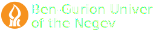
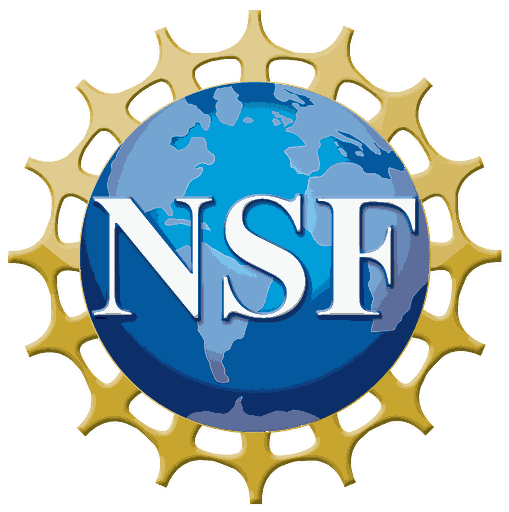

<h1 class="hf-hero-title">EEGDash: the Python library for 700+ BIDS-first EEG/MEG datasets.</h1>

Install with `pip install eegdash`, then load, preprocess, and train
PyTorch models on open EEG/MEG data in minutes. Works hand-in-hand with
MNE-Python and braindecode.

<form class="hf-search" action="dataset_summary.html" method="get" role="search" aria-label="Dataset search">
  <label class="hf-sr-only" for="hf-search-input">Search datasets</label>
  <div class="hf-search-input-wrap">
    <span class="hf-search-icon" aria-hidden="true">&#128269;</span>
    <input
      id="hf-search-input"
      class="hf-search-input"
      type="search"
      name="q"
      placeholder="Search datasets (e.g., visual, P300, resting-state)"
      autocomplete="off"
    />
    <button class="hf-search-submit" type="submit">Search</button>
  </div>
  <div class="hf-search-suggest">
    <span class="hf-suggest-label">Suggested:</span>
    <a class="hf-suggest-link" data-query="ds004504" href="/api/dataset/eegdash.dataset.DS004504.html">ds004504</a>
    <a class="hf-suggest-link" data-query="ds000117" href="/api/dataset/eegdash.dataset.DS000117.html">ds000117</a>
    <a class="hf-suggest-link" data-query="nm000107" href="/api/dataset/eegdash.dataset.NM000107.html">nm000107</a>
  </div>
</form>

[Browse datasets](dataset_summary.md)

[Get started](install/install.md)

Quickstart

### Install

```bash
pip install eegdash
```

### First search

```python
from eegdash import EEGDash

eegdash = EEGDash()
records = eegdash.find(dataset="ds002718")
print(f"Found {len(records)} records.")
```

Works with Python 3.10+. BIDS-first. Runs locally.

[Run your first search](user_guide.md)

[Read the Docs](api/api.md)

<h2 class="hf-section-title">At a glance</h2>
<p class="hf-section-subtitle">Search-first discovery with reproducible pipelines and standardized metadata.</p>
<!-- Badges come from shield/badge services (GitHub Actions, img.shields.io,
pepy.tech, codecov) whose SVGs have variable natural widths driven by
the text content. Hard-coding ``:width:`` + ``:height:`` to nice
round numbers distorts the aspect ratio — PSI flagged e.g. PyPI
versions 140x20 displayed vs 198x20 natural. Only ``:width:`` is
set; browsers compute height from the SVG's own aspect ratio, which
still reserves layout space thanks to the SVG's intrinsic
dimensions. No CLS regression. -->[](https://github.com/eegdash/EEGDash/actions/workflows/tests.yml)[](https://github.com/eegdash/EEGDash/actions/workflows/doc.yaml)[](https://pypi.org/project/eegdash/)[](https://pypi.org/project/eegdash/)[](https://pepy.tech/project/eegdash)[](https://codecov.io/gh/eegdash/EEGDash)[](https://github.com/eegdash/EEGDash/blob/main/LICENSE)[](https://github.com/eegdash/EEGDash)

700+

Curated and standardized metadata ready to explore.

5

EEG, MEG, fNIRS, EMG, and iEEG coverage.

BIDS

Interoperability and reproducibility baked in.

GitHub

Community-driven datasets, pipelines, and benchmarks.

Build with the community

Share datasets, contribute pipelines, and help define open standards for EEG and MEG.

[GitHub](https://github.com/eegdash/EEGDash)

[Join Discord](https://discord.gg/8jd7nVKwsc)

Support Institutions



Funders



AWS Open Data Sponsorship Program
